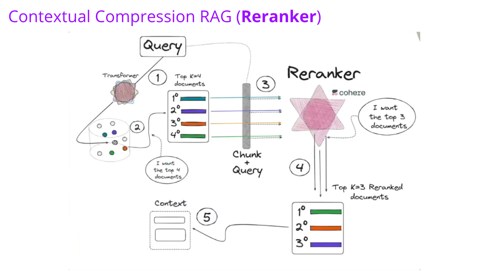

  
  
  
  
  
  
	
  
  
  

  

# Rerank RAG

## ✒️ Descrição
Neste projeto, exploramos o uso do Rerank, uma etapa que reclassifica os trechos recuperados do documento do Projeto de Lei de Inteligência Artificial (PL 2338/2023), organizando-os por relevância contextual antes de serem enviados ao modelo de linguagem. Isso melhora significativamente a precisão e a utilidade das respostas geradas.

As tecnologias utilizadas incluem a Cohere API, responsável pela geração de embeddings e reranking, e um VectorDB (banco de dados vetorial) para o armazenamento e a busca eficiente dos vetores semânticos.

## 🚀 Tecnologias utilizadas

 
      

## 📷 Demostração
Apresentação do esquema da aplicação.

  
  

## 🔥 Instalação
Clone o repositório.
~~~
git clone git@github.com:vian4dev/rerank-rag.git
~~~
Acesse o diretório do projeto.
~~~
cd rerank-rag/
~~~
Crie o arquivo .env na raiz do diretório.
~~~
OPENAI_API_KEY=""
COHERE_API_KEY=""

⚠️ Será necessário gerar um token na OpenAI platform.
⚠️ Será necessário gerar um token na Cohere platform.
~~~
Instale as dependências.
~~~
pip install -r requirements.txt
~~~
Execute a aplicação no Jupyter Notebook ou VScode.
~~~
main.ipynb
~~~

## 📝 Licença
Esse projeto está sob a licença MIT. Veja o arquivo [LICENSE](LICENSE) para mais detalhes.

---

 
 
Desenvolvido por - <a href="https://github.com/vian4dev">Gabriel Viana</a> 🤖

 
  

